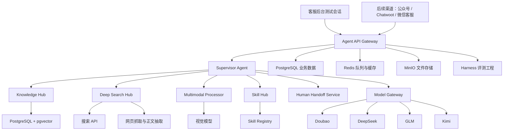
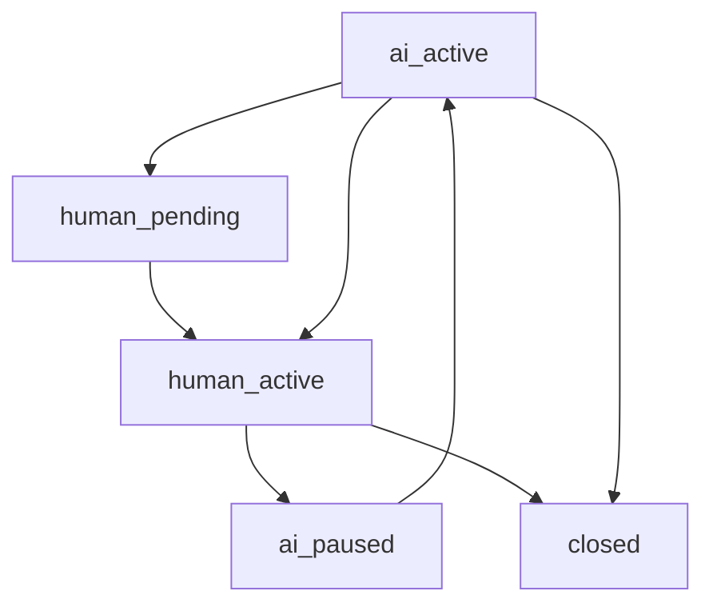

# Hifleet 企业级客服 Agent 需求重构方案

## 文档信息

| 字段 | 内容 |
|---|---|
| 文档名称 | Hifleet 企业级客服 Agent 需求重构方案 |
| 当前版本 | v1.0.0 |
| 文档状态 | 需求重构版，可进入研发方案拆解 |
| 创建日期 | 2026-06-03 |
| 适用项目 | Hifleet 智能客服 / 企业 Agent 平台 |
| 优先交付 | 自建客服 Agent 平台 MVP |
| 部署环境 | 本地 Linux 服务器 |

## 版本管理

### 版本记录

| 版本 | 日期 | 变更说明 | 状态 |
|---|---|---|---|
| v0.1.0 | 2026-05 | 基于 Coze / OpenClaw / 多渠道接入的初步 Agent 矩阵方案 | 历史方案 |
| v0.2.0 | 2026-05 | 形成 `agent-execution` 分阶段文档，偏向内部数字员工优先 | 历史方案 |
| v1.0.0 | 2026-06-03 | 重构为“客服 Agent 平台优先”，确认自建标准客服后台、MVP 先不接真实渠道、Skills 先设计架构 | 当前方案 |

### 版本原则

1. 本文档作为后续研发拆解、排期、评审和验收的主需求基线。
2. 后续需求变更必须新增版本记录，不直接覆盖已确认结论。
3. MVP 阶段优先保证主链路闭环，不把公众号、Chatwoot、微信客服、数字员工全部塞入第一期。
4. 渠道接入层只做入口适配，不承载 Agent 业务逻辑。
5. Skills、知识库、会话、人工接管、审计必须平台化设计，避免后续多渠道重复开发。

## 一、需求背景

Hifleet 当前希望开发一套企业级智能客服 / 企业 Agent 平台。早期方案以 Coze 智能体为核心，能够快速验证知识库问答和部分业务流程，但在长期生产化中存在以下问题：

- 模型选择受限，无法灵活调用 `doubao`、`deepseek`、`glm`、`kimi` 等国内模型。
- 多模态、深度网页检索、复杂业务 Skills 和任务执行能力受平台边界限制。
- 公众号、网页客服、微信客服、企业内部数字员工等渠道逻辑分散。
- 微信客服平台接入 API 后，原微信客服后台可能无法完整查看消息，需要自建消息同步和人工干预能力。
- 后续文件分析、报告生成、消息定制、订阅通知等数字员工能力需要更强的执行隔离和审计能力。

因此，本次需求重构的核心方向是：从“接一个平台型 Bot”升级为“自建 Hifleet Agent 服务平台”。

## 二、已确认的关键决策

| 决策项 | 当前结论 |
|---|---|
| 平台策略 | 完全自建，不继续以 Coze 作为核心 Agent 平台 |
| 部署方式 | 本地 Linux 服务器部署 |
| 模型策略 | 优先调用国内模型：`doubao`、`deepseek`、`glm`、`kimi` 等 |
| 后台策略 | 自建标准客服后台，不复用 Chatwoot 作为主后台 |
| MVP 渠道 | 第一阶段只做后台内置测试会话 + Agent API，不接真实渠道 |
| Skills 策略 | 第一阶段先设计 Skills 架构，后续逐步接入 Hifleet 船舶业务 API |
| 多模态策略 | 第一阶段优先支持图片，语音预留接口 |
| Harness 策略 | 第一阶段即建设 Agent 评测与回归测试工程 |
| 后续渠道 | 公众号、Chatwoot、微信客服平台按阶段接入 |
| 后续增强 | 数字员工、文件分析、报告生成、订阅通知、沙箱执行后续扩展 |

## 三、产品定位

本项目不是单一聊天机器人，而是 Hifleet 的统一客服 Agent 平台底座。

平台需要同时支撑三类未来场景：

1. **客服 Agent**
   - 面向外部用户和内部客服人员。
   - 回答 Hifleet 平台使用、业务规则、船舶数据相关问题。
   - 支持知识库、网页检索、多模态、人工接管。

2. **业务 Skills Agent**
   - 面向 Hifleet 船舶数据处理业务。
   - 通过标准 Skill 协议调用内部 API。
   - 支持船位查询、船舶档案、港口/区域统计等能力。

3. **企业数字员工**
   - 面向内部员工和后续外部客户定制任务。
   - 支持文件分析、报告生成、消息定制、订阅通知。
   - 复杂任务必须在隔离沙箱中执行。

## 四、MVP 目标与范围

### 4.1 MVP 目标

第一期 MVP 的目标是搭建一套可持续扩展的 Agent 平台主链路：

```text
客服后台测试会话 -> Agent API -> 模型网关 -> 知识库 / 网页检索 / 多模态 / Skills 架构 -> 回复与审计记录
```

MVP 完成后，开发团队应能够在后台直接创建测试会话，验证：

- 用户问题能进入 Agent API。
- Agent 能调用国内模型生成回答。
- Agent 能基于知识库回答问题。
- Agent 能在需要时执行深度网页检索。
- Agent 能处理图片输入。
- Agent 能识别潜在 Skill 调用意图，并按标准 Skill 协议记录调用过程。
- 客服人员能在后台查看对话、接管会话、暂停 AI、恢复 AI、备注处理结果。
- Harness 能对标准问题集进行回归测试。

### 4.2 MVP 必做范围

| 模块 | MVP 是否必做 | 说明 |
|---|---|---|
| Agent API | 必做 | 提供统一聊天入口，供后台和后续渠道调用 |
| 模型网关 | 必做 | 统一封装国内模型调用 |
| 知识库 RAG | 必做 | 支持 FAQ / Wiki / Raw Docs 检索 |
| 深度网页检索 | 必做 | 支持搜索、抓取、摘要、来源引用 |
| 图片多模态 | 必做 | 支持图片上传与视觉模型理解 |
| 语音能力 | 预留 | 只预留 ASR/TTS 接口，不作为第一期验收 |
| Skills 架构 | 必做 | 建立 Skill Registry、调用协议和审计记录 |
| 船舶业务 API | 暂缓完整接入 | 第一阶段可做 mock 或少量样例，不要求全量接入 |
| 标准客服后台 | 必做 | 会话、消息、人工接管、AI 暂停/恢复、备注 |
| Harness 工程 | 必做 | 标准问题集、模型对比、RAG/Skill 回归测试 |
| 公众号接入 | 暂缓 | Phase 3 接入 |
| Chatwoot 接入 | 暂缓 | Phase 3 接入 |
| 微信客服平台 | 暂缓 | Phase 4 接入 |
| 文件分析与报告 | 暂缓 | Phase 5 接入 |

### 4.3 MVP 不做范围

第一期明确不做以下内容：

- 不接真实微信公众号生产流量。
- 不接真实 Chatwoot 网页客服流量。
- 不直接接微信客服平台。
- 不做完整工单系统。
- 不做客服排班与自动分配。
- 不做复杂质检评分。
- 不做生产数据写操作。
- 不做高风险自动执行任务。
- 不做完整数字员工文件分析沙箱。
- 不做多租户商业化管理。

## 五、总体架构



### 5.1 架构原则

1. **渠道与能力分离**
   - 公众号、Chatwoot、微信客服只是接入层。
   - 核心 Agent 能力统一放在 Agent API 后端。

2. **模型与业务分离**
   - 业务代码不直接依赖某个模型 SDK。
   - 所有模型调用统一走 `ModelGateway`。

3. **Skill 与 Prompt 分离**
   - 业务 API 不写进 Prompt。
   - Skills 必须结构化注册、结构化调用、结构化审计。

4. **AI 与人工协同**
   - 后台必须支持 AI 暂停、人工接管、恢复 AI。
   - 人工接管后 AI 不得继续自动回复。

5. **可测试优先**
   - Harness 从第一期开始建设。
   - 每次 Prompt、模型、知识库、Skill 变更后都可回归测试。

## 六、核心模块设计

### 6.1 Agent API Gateway

职责：

- 接收后台测试会话请求。
- 后续接收公众号、Chatwoot、微信客服等渠道请求。
- 统一生成 `conversation`、`message`、`request_id`。
- 调用 `SupervisorAgent`。
- 将回复写入消息表。
- 根据会话状态决定是否允许 AI 自动回复。

MVP 重点接口：

| 接口 | 方法 | 用途 |
|---|---|---|
| `/api/v1/chat` | POST | 统一聊天入口 |
| `/api/v1/conversations` | GET | 获取会话列表 |
| `/api/v1/conversations/{id}` | GET | 获取会话详情 |
| `/api/v1/conversations/{id}/handoff` | POST | 人工接管 |
| `/api/v1/conversations/{id}/resume-ai` | POST | 恢复 AI |
| `/api/v1/conversations/{id}/notes` | POST | 添加客服备注 |
| `/api/v1/tool-calls` | GET | 查询工具调用 |
| `/api/v1/harness/runs` | GET | 查看评测结果 |

### 6.2 Supervisor Agent

职责：

- 判断用户请求类型。
- 决定调用知识库、网页检索、多模态、Skill 或人工接管。
- 控制回答边界，避免模型编造。
- 对工具结果进行汇总解释。

MVP 意图分类：

| 意图 | 处理方式 |
|---|---|
| `faq_query` | 调用 Knowledge Hub |
| `web_research` | 调用 Deep Search Hub |
| `image_understanding` | 调用 Multimodal Processor |
| `skill_candidate` | 生成 Skill 调用计划，按 MVP 配置决定 mock 或执行 |
| `handoff_required` | 标记为需要人工 |
| `general_chat` | 直接模型回答，但需遵守客服边界 |

### 6.3 Model Gateway

职责：

- 统一调用国内模型。
- 统一处理超时、重试、错误格式。
- 记录模型调用日志。
- 支持后续按任务类型、成本、时延、质量路由。

建议模型策略：

| 任务类型 | 推荐模型方向 |
|---|---|
| 常规客服问答 | doubao / kimi |
| 复杂推理与长问题 | deepseek |
| 中文长上下文总结 | glm / kimi |
| 图片理解 | doubao vision / qwen-vl 类模型 |
| Harness 对比评测 | 同一问题并行跑多个候选模型 |

### 6.4 Knowledge Hub

职责：

- 管理 Hifleet 知识文档。
- 支持文档导入、切片、向量化、检索。
- 返回带来源的证据片段。
- 为回答提供引用依据。

知识分层：

| 层级 | 内容 | 优先级 |
|---|---|---|
| FAQ | 标准问答、客服话术 | 最高 |
| Wiki | 产品说明、业务说明、操作手册 | 高 |
| Raw Docs | 原始文档、历史资料 | 中 |
| Web Cache | 深度网页检索缓存 | 按需 |

检索流程：

```text
用户问题 -> query rewrite -> 关键词检索 + 向量检索 -> rerank -> 证据片段 -> 模型生成回答 -> 来源引用
```

### 6.5 Deep Search Hub

职责：

- 判断是否需要外部网页知识。
- 调用搜索 API。
- 抓取候选网页正文。
- 清洗、摘要、去重。
- 生成带来源的答案。

MVP 流程：

```text
搜索关键词生成
-> 搜索结果获取
-> URL 白名单 / 黑名单过滤
-> 网页正文抽取
-> 内容摘要
-> 交叉验证
-> 生成回答并附来源
```

注意：

- 深度网页检索不能覆盖企业私有知识优先级。
- 涉及 Hifleet 平台规则时，优先使用内部知识库。
- 外部网页结果必须标注来源与时间。

### 6.6 Multimodal Processor

职责：

- 处理图片、语音等非文本消息。
- 第一阶段优先支持图片。
- 将图片理解结果转换为 Agent 可使用的文本上下文。

MVP 图片流程：

```text
图片上传 -> MinIO 存储 -> 视觉模型理解 -> 结构化描述 -> 进入 Agent 上下文 -> 回复
```

语音预留流程：

```text
语音上传 -> ASR 转写 -> Agent 回复 -> 可选 TTS
```

### 6.7 Skill Hub

职责：

- 统一注册 Skills。
- 向 Agent 暴露可调用能力说明。
- 校验输入参数。
- 执行或模拟执行 Skill。
- 记录 `ToolCall`。

MVP 阶段只要求完成 Skill 架构，不要求全面接入 Hifleet 船舶业务 API。

Skill 定义结构：

```json
{
  "name": "ship.position.query",
  "display_name": "船位查询",
  "description": "根据船名、MMSI 或 IMO 查询船舶当前位置。",
  "input_schema": {
    "type": "object",
    "required": ["keyword"],
    "properties": {
      "keyword": {
        "type": "string",
        "description": "船名、MMSI 或 IMO"
      }
    }
  },
  "output_schema": {
    "type": "object",
    "properties": {
      "status": {
        "type": "string"
      },
      "data": {
        "type": "object"
      }
    }
  },
  "permission_level": "query",
  "execution_mode": "mock_or_http"
}
```

预留 Skills：

| Skill 名称 | 说明 | MVP 状态 |
|---|---|---|
| `ship.position.query` | 船位查询 | 架构预留，可 mock |
| `ship.profile.query` | 船舶档案查询 | 架构预留 |
| `port.vessel.count` | 港口船舶数量统计 | 架构预留 |
| `area.vessel.statistics` | 区域船舶统计 | 架构预留 |
| `bridge.monitor.query` | 桥梁 / 海峡监测结果查询 | 架构预留 |

### 6.8 Human Handoff Service

职责：

- 管理 AI 与人工客服的协同状态。
- 支持人工接管、AI 暂停、AI 恢复。
- 记录客服备注和处理结果。

状态机：



状态说明：

| 状态 | 含义 |
|---|---|
| `ai_active` | AI 正常自动回复 |
| `human_pending` | 系统建议人工介入，等待客服确认 |
| `human_active` | 人工已接管，AI 停止自动回复 |
| `ai_paused` | AI 被人工暂停，可稍后恢复 |
| `closed` | 会话已结束 |

## 七、标准客服后台需求

### 7.1 用户角色

| 角色 | 权限 |
|---|---|
| 管理员 | 查看全部会话、配置模型、管理知识库、查看 Harness |
| 客服人员 | 查看会话、人工接管、回复、备注、暂停/恢复 AI |
| 只读观察员 | 查看会话和统计，不可接管和修改 |

### 7.2 页面清单

| 页面 | MVP 是否必做 | 功能 |
|---|---|---|
| 登录页 | 必做 | 管理员 / 客服登录 |
| 会话列表 | 必做 | 按状态、渠道、时间、关键词筛选会话 |
| 会话详情 | 必做 | 查看用户消息、AI 回复、人工回复、工具调用 |
| 人工接管操作 | 必做 | 接管、暂停 AI、恢复 AI、关闭会话 |
| 客服备注 | 必做 | 添加内部备注，不发送给用户 |
| 工具调用详情 | 必做 | 查看 Skill / 知识库 / 网页检索调用过程 |
| Harness 结果页 | 建议必做 | 查看评测运行结果 |
| 知识库管理 | 暂缓 | 后续可做上传、重建索引、命中分析 |
| 统计看板 | 暂缓 | 后续做响应时长、命中率、转人工率 |

### 7.3 会话详情页需要展示

- 用户基础信息。
- 当前会话状态。
- 消息时间线。
- AI 回复内容。
- 人工回复内容。
- AI 是否暂停。
- 触发过哪些工具。
- 检索过哪些知识片段。
- 网页检索来源。
- 错误信息和失败原因。
- 客服备注。

## 八、数据表设计

### 8.1 `users`

统一用户主表。第一期主要服务后台测试用户，后续绑定公众号 openid、Chatwoot visitor、微信客服 external_userid 等。

| 字段 | 类型 | 说明 |
|---|---|---|
| `id` | uuid | 主键 |
| `display_name` | varchar | 用户显示名 |
| `user_type` | varchar | `external_customer` / `internal_employee` / `admin` / `test_user` |
| `status` | varchar | `active` / `disabled` |
| `metadata` | jsonb | 扩展信息 |
| `created_at` | timestamptz | 创建时间 |
| `updated_at` | timestamptz | 更新时间 |

### 8.2 `channel_bindings`

渠道身份绑定表。

| 字段 | 类型 | 说明 |
|---|---|---|
| `id` | uuid | 主键 |
| `user_id` | uuid | 关联 `users.id` |
| `channel_type` | varchar | `console` / `wechat_official` / `chatwoot` / `wechat_kf` |
| `channel_user_id` | varchar | 渠道侧用户 ID |
| `channel_session_id` | varchar | 渠道侧会话 ID，可为空 |
| `status` | varchar | `active` / `inactive` |
| `created_at` | timestamptz | 创建时间 |
| `updated_at` | timestamptz | 更新时间 |

### 8.3 `conversations`

会话表。

| 字段 | 类型 | 说明 |
|---|---|---|
| `id` | uuid | 主键 |
| `user_id` | uuid | 用户 ID |
| `channel_type` | varchar | 来源渠道 |
| `title` | varchar | 会话标题 |
| `status` | varchar | `open` / `closed` |
| `handoff_status` | varchar | `ai_active` / `human_pending` / `human_active` / `ai_paused` / `closed` |
| `assigned_agent_id` | uuid | 人工客服 ID，可为空 |
| `last_message_at` | timestamptz | 最近消息时间 |
| `summary` | text | 会话摘要 |
| `metadata` | jsonb | 扩展信息 |
| `created_at` | timestamptz | 创建时间 |
| `updated_at` | timestamptz | 更新时间 |

### 8.4 `messages`

消息表。

| 字段 | 类型 | 说明 |
|---|---|---|
| `id` | uuid | 主键 |
| `conversation_id` | uuid | 会话 ID |
| `sender_type` | varchar | `user` / `assistant` / `human_agent` / `system` |
| `sender_id` | uuid | 发送者 ID，可为空 |
| `message_type` | varchar | `text` / `image` / `voice` / `file` / `system` |
| `content` | text | 文本内容 |
| `content_payload` | jsonb | 多模态结构化内容 |
| `channel_message_id` | varchar | 渠道消息 ID |
| `send_status` | varchar | `received` / `sent` / `failed` |
| `created_at` | timestamptz | 创建时间 |

### 8.5 `attachments`

附件表。

| 字段 | 类型 | 说明 |
|---|---|---|
| `id` | uuid | 主键 |
| `message_id` | uuid | 消息 ID |
| `file_name` | varchar | 文件名 |
| `file_type` | varchar | `image` / `voice` / `file` |
| `mime_type` | varchar | MIME 类型 |
| `storage_url` | text | MinIO 或本地对象存储地址 |
| `size_bytes` | bigint | 文件大小 |
| `metadata` | jsonb | 图片识别结果、语音识别结果等 |
| `created_at` | timestamptz | 创建时间 |

### 8.6 `model_calls`

模型调用记录表。

| 字段 | 类型 | 说明 |
|---|---|---|
| `id` | uuid | 主键 |
| `conversation_id` | uuid | 会话 ID |
| `message_id` | uuid | 触发消息 ID |
| `provider` | varchar | `doubao` / `deepseek` / `glm` / `kimi` |
| `model_name` | varchar | 具体模型名 |
| `prompt_tokens` | integer | 输入 token |
| `completion_tokens` | integer | 输出 token |
| `latency_ms` | integer | 耗时 |
| `status` | varchar | `success` / `failed` |
| `error_message` | text | 错误信息 |
| `created_at` | timestamptz | 创建时间 |

### 8.7 `knowledge_documents`

知识文档表。

| 字段 | 类型 | 说明 |
|---|---|---|
| `id` | uuid | 主键 |
| `title` | varchar | 文档标题 |
| `source_type` | varchar | `faq` / `wiki` / `raw` / `web` |
| `source_path` | text | 文件路径或 URL |
| `content_hash` | varchar | 内容 hash |
| `status` | varchar | `active` / `archived` |
| `created_at` | timestamptz | 创建时间 |
| `updated_at` | timestamptz | 更新时间 |

### 8.8 `knowledge_chunks`

知识切片表，需启用 pgvector。

| 字段 | 类型 | 说明 |
|---|---|---|
| `id` | uuid | 主键 |
| `document_id` | uuid | 文档 ID |
| `chunk_index` | integer | 切片序号 |
| `content` | text | 切片内容 |
| `embedding` | vector | 向量 |
| `metadata` | jsonb | 页码、标题、来源等 |
| `created_at` | timestamptz | 创建时间 |

### 8.9 `retrieval_logs`

知识库和网页检索日志。

| 字段 | 类型 | 说明 |
|---|---|---|
| `id` | uuid | 主键 |
| `conversation_id` | uuid | 会话 ID |
| `message_id` | uuid | 用户消息 ID |
| `retrieval_type` | varchar | `knowledge` / `web_search` / `hybrid` |
| `query` | text | 检索 query |
| `results` | jsonb | 命中结果 |
| `latency_ms` | integer | 耗时 |
| `created_at` | timestamptz | 创建时间 |

### 8.10 `skills`

Skill 注册表。

| 字段 | 类型 | 说明 |
|---|---|---|
| `id` | uuid | 主键 |
| `name` | varchar | Skill 唯一名 |
| `display_name` | varchar | 展示名 |
| `description` | text | 能力说明 |
| `input_schema` | jsonb | 输入 JSON Schema |
| `output_schema` | jsonb | 输出 JSON Schema |
| `permission_level` | varchar | `query` / `write_confirmed` / `admin_only` |
| `execution_mode` | varchar | `mock` / `http` / `python` / `sandbox` |
| `config` | jsonb | 执行配置 |
| `enabled` | boolean | 是否启用 |
| `created_at` | timestamptz | 创建时间 |
| `updated_at` | timestamptz | 更新时间 |

### 8.11 `tool_calls`

工具 / Skill 调用记录表。

| 字段 | 类型 | 说明 |
|---|---|---|
| `id` | uuid | 主键 |
| `conversation_id` | uuid | 会话 ID |
| `message_id` | uuid | 触发消息 ID |
| `skill_id` | uuid | Skill ID，可为空 |
| `tool_name` | varchar | 工具名 |
| `input_payload` | jsonb | 输入参数 |
| `output_payload` | jsonb | 输出结果 |
| `status` | varchar | `planned` / `success` / `failed` / `skipped` |
| `latency_ms` | integer | 耗时 |
| `error_message` | text | 错误信息 |
| `created_at` | timestamptz | 创建时间 |

### 8.12 `handoff_events`

人工接管事件表。

| 字段 | 类型 | 说明 |
|---|---|---|
| `id` | uuid | 主键 |
| `conversation_id` | uuid | 会话 ID |
| `event_type` | varchar | `request_handoff` / `takeover` / `pause_ai` / `resume_ai` / `close` |
| `operator_id` | uuid | 操作人 ID |
| `reason` | text | 原因 |
| `metadata` | jsonb | 扩展信息 |
| `created_at` | timestamptz | 创建时间 |

### 8.13 `conversation_notes`

客服备注表。

| 字段 | 类型 | 说明 |
|---|---|---|
| `id` | uuid | 主键 |
| `conversation_id` | uuid | 会话 ID |
| `author_id` | uuid | 备注人 ID |
| `content` | text | 备注内容 |
| `created_at` | timestamptz | 创建时间 |

### 8.14 `harness_cases`

Harness 测试用例表。

| 字段 | 类型 | 说明 |
|---|---|---|
| `id` | uuid | 主键 |
| `case_name` | varchar | 用例名称 |
| `category` | varchar | `faq` / `rag` / `web_search` / `skill` / `multimodal` |
| `input_payload` | jsonb | 输入 |
| `expected_behavior` | jsonb | 期望行为 |
| `enabled` | boolean | 是否启用 |
| `created_at` | timestamptz | 创建时间 |
| `updated_at` | timestamptz | 更新时间 |

### 8.15 `harness_runs`

Harness 运行记录表。

| 字段 | 类型 | 说明 |
|---|---|---|
| `id` | uuid | 主键 |
| `run_name` | varchar | 运行名称 |
| `model_config` | jsonb | 模型配置 |
| `status` | varchar | `running` / `completed` / `failed` |
| `summary` | jsonb | 汇总结果 |
| `created_at` | timestamptz | 创建时间 |
| `finished_at` | timestamptz | 完成时间 |

### 8.16 `harness_results`

Harness 单用例结果表。

| 字段 | 类型 | 说明 |
|---|---|---|
| `id` | uuid | 主键 |
| `run_id` | uuid | 运行 ID |
| `case_id` | uuid | 用例 ID |
| `actual_output` | jsonb | 实际输出 |
| `score` | numeric | 得分 |
| `passed` | boolean | 是否通过 |
| `failure_reason` | text | 失败原因 |
| `created_at` | timestamptz | 创建时间 |

## 九、研发任务拆解

### Phase 0：工程底座

目标：搭建可以长期演进的基础工程。

| 编号 | 任务 | 交付物 | 验收标准 |
|---|---|---|---|
| P0-01 | 初始化后端工程 | FastAPI 项目、配置系统、目录结构 | 服务可本地启动 |
| P0-02 | Docker Compose | PostgreSQL、Redis、MinIO、后端服务 | 一条命令启动基础依赖 |
| P0-03 | 数据库迁移 | Alembic migration | 核心表可创建 |
| P0-04 | 登录与权限基础 | 管理员、客服、只读角色 | 后台接口可鉴权 |
| P0-05 | 日志与错误处理 | 结构化日志、中间件 | API 错误有统一响应 |
| P0-06 | Harness 基础框架 | 用例表、运行表、结果表 | 可手动运行一批测试用例 |

### Phase 1：Agent 核心能力

目标：后台测试会话能跑通客服 Agent 主链路。

| 编号 | 任务 | 交付物 | 验收标准 |
|---|---|---|---|
| P1-01 | Agent API | `/api/v1/chat` | 后台可发送文本并获得回复 |
| P1-02 | Model Gateway | 国内模型统一调用接口 | 至少接入 1 个文本模型 |
| P1-03 | 会话与消息落库 | `conversations`、`messages` | 每轮对话可追踪 |
| P1-04 | Supervisor Agent | 意图分类与路由 | 可区分 FAQ、网页检索、图片、Skill 候选 |
| P1-05 | Knowledge Hub | 文档导入、切片、向量检索 | 能基于知识库回答并返回来源 |
| P1-06 | Deep Search Hub | 搜索、抓取、摘要 | 能返回带来源的网页检索答案 |
| P1-07 | 图片多模态 | 图片上传、视觉理解 | 后台上传图片后可生成描述并参与回答 |
| P1-08 | Skill Hub 架构 | `skills`、`tool_calls`、注册协议 | 可注册 mock Skill 并记录调用 |
| P1-09 | 失败兜底 | 模型失败、检索失败、Skill 失败处理 | 失败原因可见，不伪造结果 |

### Phase 2：标准客服后台

目标：后台成为可试用的 AI + 人工客服工作台。

| 编号 | 任务 | 交付物 | 验收标准 |
|---|---|---|---|
| P2-01 | 登录页 | 后台登录 UI | 不登录不可访问后台 |
| P2-02 | 会话列表 | 列表、筛选、状态显示 | 可按状态查看会话 |
| P2-03 | 会话详情 | 消息流、工具调用、检索来源 | 可完整复盘一次对话 |
| P2-04 | 人工接管 | 接管按钮、状态变化 | 接管后 AI 不自动回复 |
| P2-05 | AI 暂停/恢复 | 暂停 AI、恢复 AI | 状态变化有记录 |
| P2-06 | 客服备注 | 添加和查看备注 | 备注不发送给用户 |
| P2-07 | Harness 结果页 | 运行列表、结果详情 | 可查看用例通过率和失败原因 |

### Phase 3：公众号与 Chatwoot 接入

目标：将已有外部入口迁移到自建 Agent API。

| 编号 | 任务 | 交付物 | 验收标准 |
|---|---|---|---|
| P3-01 | 公众号 Adapter 设计 | 入站消息标准化协议 | 文本、图片、语音事件能转换成统一请求 |
| P3-02 | 替换 Coze 调用 | 修改现有 Java 服务调用自建 Agent API | 公众号消息可由自建 Agent 回复 |
| P3-03 | 公众号异步回复 | 保留 typing、等待提示、长消息切分 | 长耗时请求不阻塞微信回调 |
| P3-04 | Chatwoot Adapter | Webhook 接收与回写 | Chatwoot 消息可调用 Agent API |
| P3-05 | 渠道消息同步 | `channel_bindings`、`channel_message_id` | 后台能看到渠道来源和消息状态 |

### Phase 4：微信客服平台

目标：解决微信客服 API 接入后的消息同步与人工干预。

| 编号 | 任务 | 交付物 | 验收标准 |
|---|---|---|---|
| P4-01 | 微信客服 API 研究与适配 | 接入文档、API 封装 | 可拉取/接收客服消息 |
| P4-02 | 消息同步服务 | 微信客服消息入库 | 后台能实时查看微信客服会话 |
| P4-03 | 人工接管联动 | AI/人工状态与微信客服消息发送联动 | 接管后 AI 停止回复 |
| P4-04 | 发送状态记录 | 投递成功、失败、重试 | 失败消息可追踪 |
| P4-05 | 客服后台增强 | 会话状态、客户标记、处理结果 | 支持真实客服试运行 |

### Phase 5：数字员工扩展

目标：扩展复杂任务处理能力。

| 编号 | 任务 | 交付物 | 验收标准 |
|---|---|---|---|
| P5-01 | 文件分析沙箱 | Docker 隔离执行环境 | 文件分析不影响主服务器 |
| P5-02 | Excel/CSV/PDF 分析 | 文件解析与报告生成 | 可生成结构化分析结果 |
| P5-03 | 报告生成 | Markdown / PDF / Excel 输出 | 可下载报告文件 |
| P5-04 | 消息定制 | 定时消息、模板消息 | 可配置并发送定制消息 |
| P5-05 | 订阅通知 | 订阅规则、事件触发、通知发送 | 支持船舶/港口类提醒 |
| P5-06 | 高风险操作确认 | 权限、确认、审计 | 写操作必须人工确认 |

## 十、Harness 工程设计

Harness 是本项目的 Agent 质量保障工程，不是可选项。

### 10.1 Harness 目标

- 评估不同模型在 Hifleet 场景下的效果。
- 评估知识库命中是否准确。
- 评估网页检索是否有来源、有质量。
- 评估 Agent 是否正确识别 Skill 调用。
- 评估 Prompt、模型、知识库变更是否造成退化。

### 10.2 测试用例分类

| 分类 | 示例 |
|---|---|
| FAQ | “Hifleet 如何查询船位？” |
| RAG | “某个平台功能如何使用？” |
| Web Search | “查询最新公开航运政策并总结来源” |
| Skill | “帮我查 EVER GIVEN 船位” |
| Multimodal | 上传一张船舶截图并询问信息 |
| Handoff | “我要投诉，找人工客服” |

### 10.3 评分维度

| 维度 | 说明 |
|---|---|
| 答案正确性 | 是否符合标准答案或关键事实 |
| 来源可靠性 | 是否引用内部知识或有效网页来源 |
| 工具选择 | 是否调用了正确 Skill |
| 参数提取 | Skill 参数是否完整准确 |
| 安全边界 | 是否拒绝编造、拒绝越权 |
| 用户体验 | 回复是否清晰、简洁、可执行 |

## 十一、接口草案

### 11.1 统一聊天接口

```http
POST /api/v1/chat
Content-Type: application/json
Authorization: Bearer <token>
```

请求：

```json
{
  "conversation_id": null,
  "channel_type": "console",
  "user": {
    "user_id": null,
    "display_name": "测试用户"
  },
  "message": {
    "type": "text",
    "content": "Hifleet 怎么查询船位？",
    "attachments": []
  },
  "metadata": {
    "source": "admin_console"
  }
}
```

响应：

```json
{
  "conversation_id": "uuid",
  "message_id": "uuid",
  "reply": {
    "type": "text",
    "content": "您可以通过..."
  },
  "handoff_status": "ai_active",
  "tool_calls": [],
  "sources": []
}
```

### 11.2 人工接管接口

```http
POST /api/v1/conversations/{conversation_id}/handoff
```

请求：

```json
{
  "reason": "用户要求人工客服",
  "operator_id": "uuid"
}
```

响应：

```json
{
  "conversation_id": "uuid",
  "handoff_status": "human_active"
}
```

### 11.3 恢复 AI 接口

```http
POST /api/v1/conversations/{conversation_id}/resume-ai
```

响应：

```json
{
  "conversation_id": "uuid",
  "handoff_status": "ai_active"
}
```

## 十二、验收标准

### 12.1 MVP 功能验收

| 验收项 | 标准 |
|---|---|
| 文本对话 | 后台测试会话可连续多轮对话 |
| 知识库回答 | 至少 20 条标准问题可基于知识库回答 |
| 来源引用 | 知识库和网页检索答案能展示来源 |
| 网页检索 | 对需要外部信息的问题可完成搜索、抓取、摘要 |
| 图片理解 | 上传图片后能生成可用描述并参与回答 |
| Skill 架构 | 至少注册 3 个 mock Skill，并记录调用 |
| 人工接管 | 接管后 AI 不再自动回复 |
| AI 恢复 | 恢复后 AI 可继续回复 |
| 客服备注 | 备注可保存且不发送给用户 |
| Harness | 至少 30 条用例可运行并生成结果 |

### 12.2 非功能验收

| 指标 | 标准 |
|---|---|
| API 稳定性 | 常规文本请求成功率不低于 95% |
| 响应时间 | 不含网页深度检索时，P95 小于 8 秒 |
| 可追踪性 | 每次模型调用、检索、Skill 调用均有记录 |
| 失败可解释 | 失败请求必须能在后台看到错误原因 |
| 数据隔离 | 附件进入对象存储，不直接散落在业务代码目录 |
| 可部署性 | Linux 服务器可通过 Docker Compose 部署 |

## 十三、后续规划

### 13.1 近期规划

1. 完成 MVP 需求评审。
2. 基于本文档拆分研发 issue。
3. 确认模型 API key、服务器资源、知识库初始资料。
4. 先建设 Phase 0 和 Phase 1。
5. 用 Harness 建立第一批标准测试集。

### 13.1.1 Phase 2 收口后的本地完整体验闭环

在不扩大 MVP 范围、不接入真实公众号/Chatwoot/微信客服的前提下，Phase 2 收口后应补一轮“本地完整体验闭环”，确保研发、测试和演示可以直接走通：

1. 为前端本地开发加入 `/api` dev proxy，避免浏览器联调时同源受阻。
2. 提供本地管理员初始化脚本，避免每次手工写 Python 片段创建账号。
3. 让 `/api/v1/chat` 在数据库可用时写入 `conversations`、`messages`、`tool_calls`、`model_calls`，使后台可复盘测试会话。
4. 启用 `ArkModelProvider` 的真实文本调用能力，用于本地验证火山模型。
5. 在后台新增最小 `Test Chat` 页面，直接从浏览器发起测试消息并跳转会话详情复盘。

这组补强的目标不是把系统升级成 Phase 3，而是让当前 MVP 具备“登录 -> 对话 -> 后台检查”的完整可体验链路。

### 13.2 中期规划

1. 接入微信公众号服务，替换现有 Coze API 调用。
2. 接入 Chatwoot 网页客服。
3. 将真实渠道消息统一进入自建后台。
4. 增强知识库管理和命中分析。
5. 接入少量真实 Hifleet 船舶查询 API。

### 13.3 长期规划

1. 接入微信客服平台，支持消息同步和人工干预。
2. 建设数字员工能力：文件分析、报告生成、任务执行。
3. 建设订阅通知能力：船舶过桥、港口统计、定时摘要。
4. 建设沙箱执行、权限审批和高风险操作确认。
5. 建设质量运营体系：质检、统计、知识更新闭环。

## 十四、开发协作建议

### 14.1 分支与版本

建议采用以下分支策略：

| 分支 | 用途 |
|---|---|
| `main` | 稳定版本 |
| `develop` | 集成开发 |
| `feature/agent-gateway` | Agent API |
| `feature/admin-console` | 客服后台 |
| `feature/knowledge-hub` | 知识库 |
| `feature/harness` | 评测工程 |
| `feature/channel-wechat-official` | 公众号接入 |
| `feature/channel-chatwoot` | Chatwoot 接入 |

### 14.2 里程碑版本

| 版本 | 内容 |
|---|---|
| `v0.1.0` | 工程底座 + 数据库 + 登录 |
| `v0.2.0` | Agent API + 模型网关 |
| `v0.3.0` | 知识库 RAG + 深度网页检索 |
| `v0.4.0` | 图片多模态 + Skill Hub 架构 |
| `v0.5.0` | 标准客服后台 |
| `v0.6.0` | Harness 回归测试 |
| `v1.0.0-mvp` | 后台测试会话完整闭环 |

### 14.3 研发注意事项

1. 不要把渠道逻辑写进 Agent 核心。
2. 不要把业务 API 写死在 Prompt 里。
3. 不要让模型口头伪造 Skill 调用结果。
4. 不要在人工接管后继续自动回复。
5. 不要跳过 Harness，只靠人工聊天验证。
6. 不要在第一期引入高风险写操作。
7. 所有模型、检索、Skill 调用都必须可追踪。

## 十五、最终结论

本次重构后的开发方案是：

**先建设 Hifleet 自建客服 Agent 平台 MVP，而不是先接真实渠道。**

第一期交付应聚焦：

- Agent API
- 国内模型网关
- 知识库 RAG
- 深度网页检索
- 图片多模态
- Skills 架构
- 标准客服后台
- Harness 评测工程

待 MVP 主链路稳定后，再按顺序接入：

1. 微信公众号
2. Chatwoot 网页客服
3. 微信客服平台
4. 数字员工与复杂任务执行

这种路线能最大限度降低第一期风险，同时为后续多渠道客服、业务 Skills、人工协同和企业数字员工能力保留清晰扩展空间。
